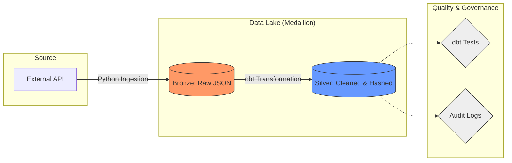

🏗️ Architecture Diagram

💡 The "Why" Section (Architectural Decisions)
Why Medallion Architecture? I chose this to ensure clear data lineage and isolation. The Bronze layer preserves the raw "source of truth," while Silver handles deduplication and hashing, providing a reliable foundation for the Gold business-ready layer.
Why dbt for Transformations? dbt was selected to bring software engineering best practices—like version control, modularity, and automated testing—to SQL.
Why Hashing (MD5/SHA256)? Implementing surrogate keys via hashing allows for deterministic record versioning and efficient incremental loads in the Silver layer.

📊 Entity Relationship Diagram (ERD)

erDiagram
    FACT_SALES ||--o{ DIM_PRODUCTS : "links_to"
    FACT_SALES ||--o{ DIM_CUSTOMERS : "links_to"
    FACT_SALES ||--o{ DIM_DATE : "links_to"
    
    FACT_SALES {
        string transaction_id PK
        string product_id FK
        string customer_id FK
        int quantity
        float total_amount
    }
    DIM_PRODUCTS {
        string product_id PK
        string category
        float price
    }
